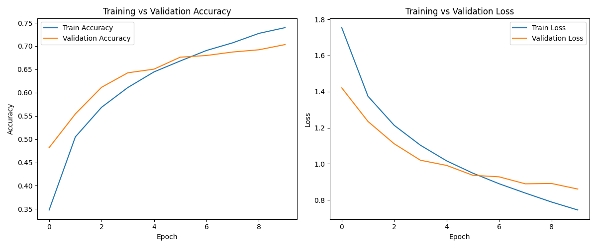
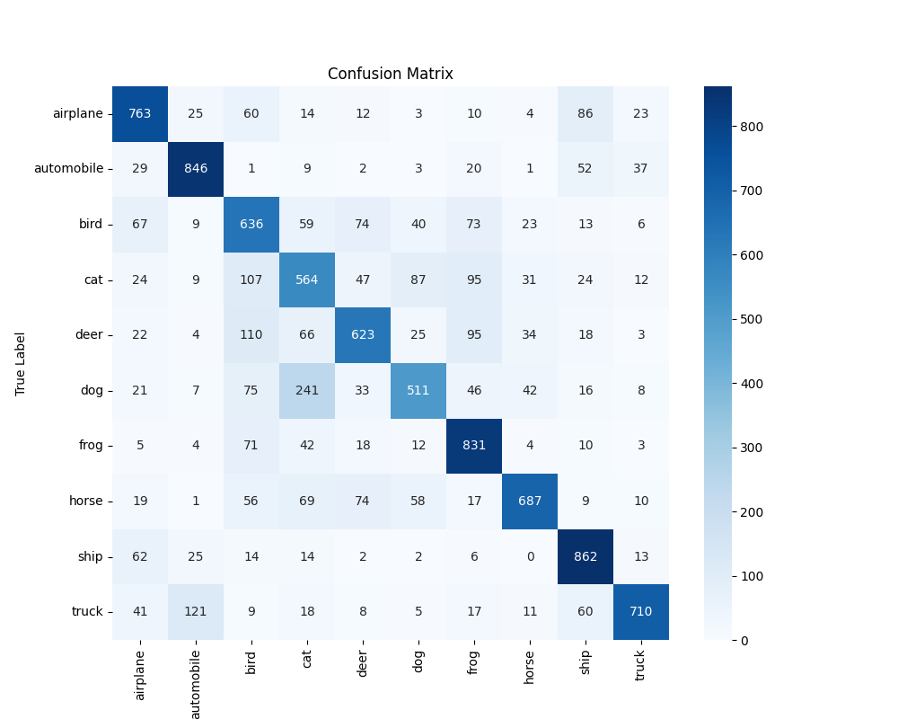
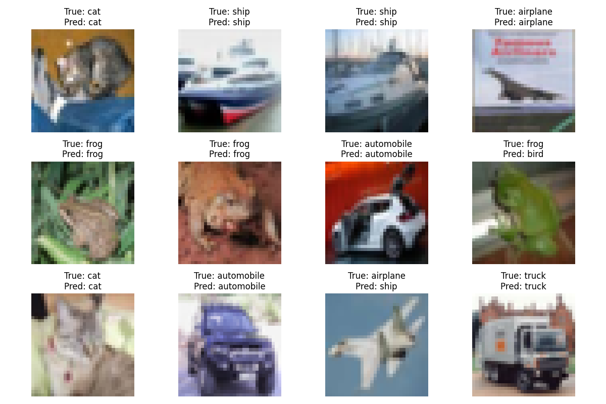

# Deep Learning Image Classification (CIFAR-10)

## 📌 Project Description
This project implements a Convolutional Neural Network (CNN) using TensorFlow to classify images from the CIFAR-10 dataset into 10 categories such as airplane, automobile, bird, cat, deer, dog, frog, horse, ship, and truck.

The model is trained, evaluated, and visualized using accuracy/loss plots, confusion matrix, and sample predictions.

---

## 🛠 Technologies Used
- Python
- TensorFlow / Keras
- NumPy
- Matplotlib
- Seaborn
- Scikit-learn

---

## 📊 Output Visualizations

### Accuracy & Loss Graph


### Confusion Matrix


### Sample Predictions


---

## 📂 Files Included
- `notebooks/cifar10_cnn_model.ipynb` → Complete implementation notebook  
- `models/cifar10_cnn_model.h5` → Saved trained model  
- `outputs/` → Visual results images  

---

## ▶️ How to Run
Install dependencies:

```bash
pip install -r requirements.txt
